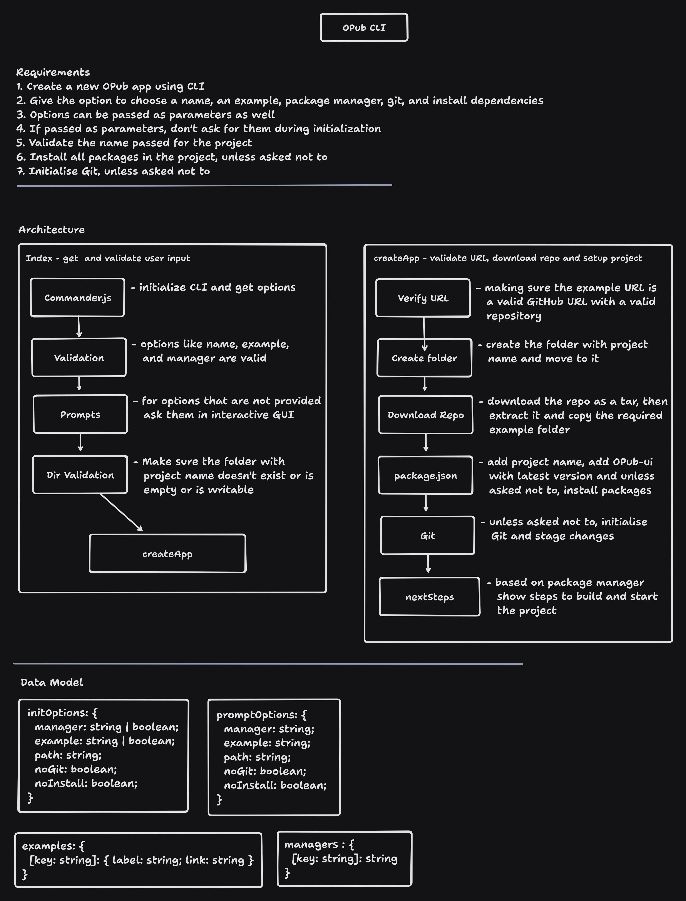

# Create OPub App

A CLI tool to create a new OPub app.

## Why

We need a way for anyone to start a new personalized OPub app as fast and easily as possible. They should be able to choose a project name, theme, or a template while starting. A CLI checks those boxes.

## Get Started

```bash
npm create opub-app
```

## Arguments

The CLI takes optinal arguments

```bash
npm create opub-app [package-name] [options]

eg: npm create opub-app my-opub-app -e d4d -m pnpm
```

### Options

- `-e, --example` - An example to bootstrap the app with. `[d4d | data-exchange]`
- `-m, --manager` - Explicitly tell the CLI to bootstrap the application using specific package manager. `[npm | pnpm | yarn | bun]`
- `--noGit` - Explicitly tell the CLI to not initialize a new git repo in the project
- `--noInstall` - Explicitly tell the CLI to not run the package manager's install command

## Tech Stack

- [commander](https://github.com/tj/commander.js) - backbone of the CLI
- [clack](https://github.com/natemoo-re/clack) - used for interactive prompt
- [got](https://github.com/sindresorhus/got) - HTML request library
- [tar](https://github.com/isaacs/node-tar) - extract tar compressed file
- [@vercel/ncc ](https://github.com/vercel/ncc)- compile Node.js modules into a single file

## Design

The CLI is designed to be as simple as possible. It asks for the project name, options and does some validations. It then fetches the template from the OPub GitHub repository and extracts it to the current working directory.



## Next Steps

- [x] Test in various environments

  - [x] Windows (WSL2)
  - [x] Linux
  - [x] Mac

- [ ] Add option to choose theme
- [x] Ask for new name if the provided one is not unique
- [x] Add option to select template based on initiative
- [x] Add support for multiple package managers

  - [x] npm
  - [x] yarn
  - [x] pnpm
  - [x] bun
