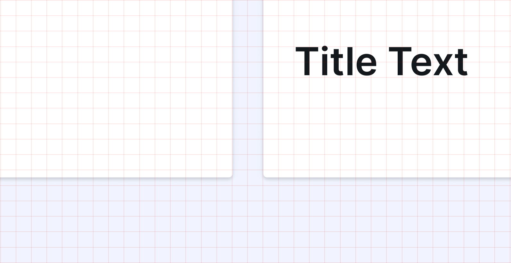
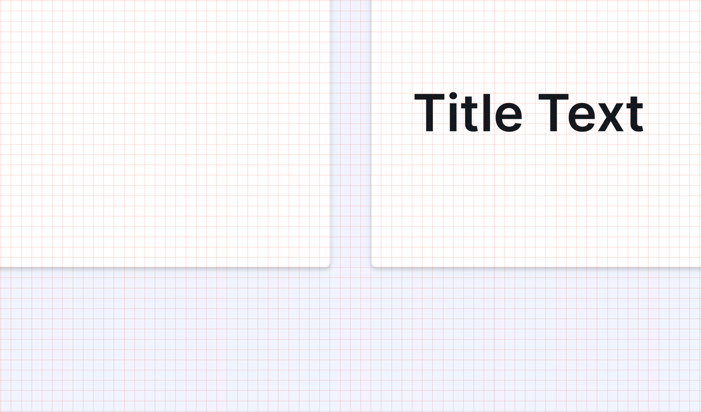
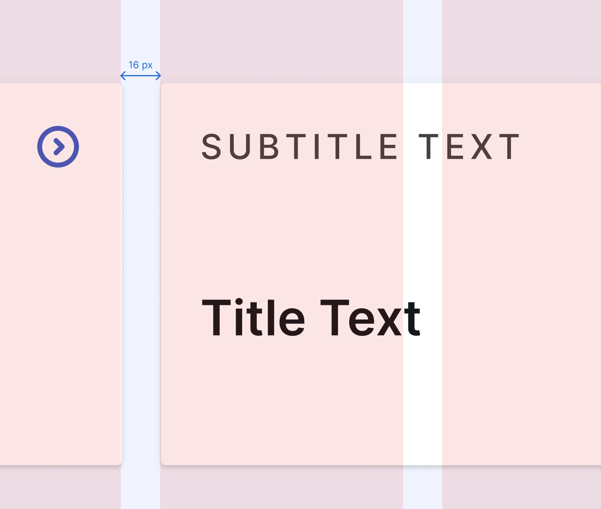
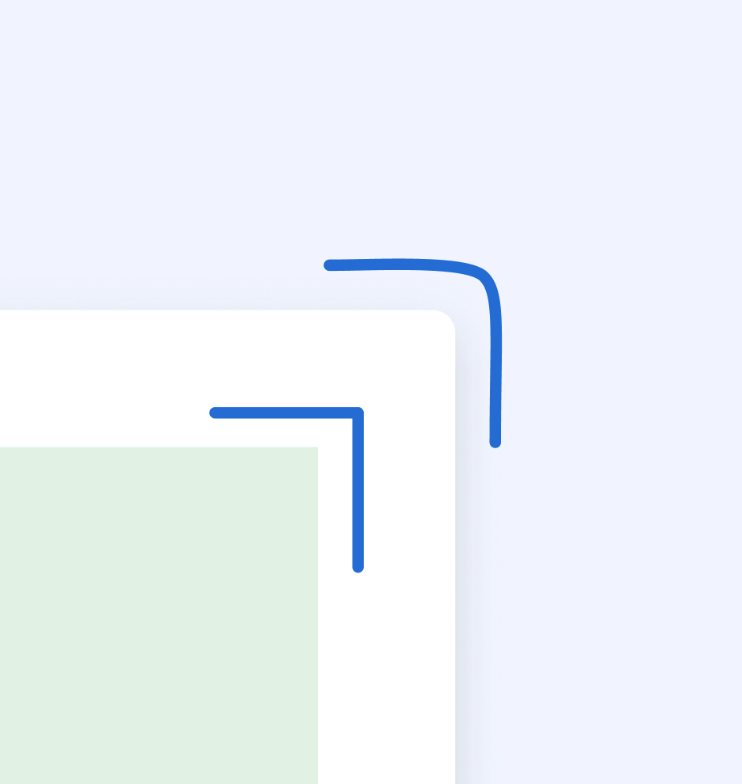
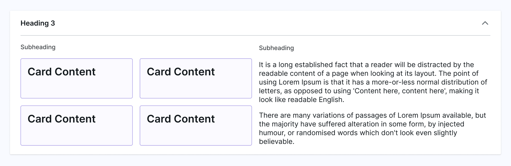
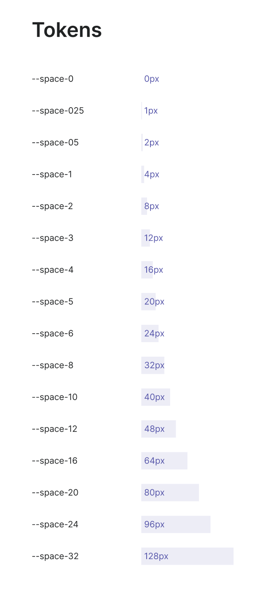

# Layout

Layout in the OPub DS determines the placement, positioning, and organisation of various components within the UI, such as buttons, menus, content sections, visualisation and other elements.

## Overview

OPub is more of a software, not a website. It needs to be treated as such. Elements need to be given hierarchy based on their importance to the user.\
Use layout to direct attention to the action/data that the users need to prioritise.

### Baseline Grid

Layouts use a standardised grid and spacing system based on multiples of four. This creates consistent interfaces across all screen sizes available today. \
Still, responsive screens must be prioritised while creating layout.

**Layouts use a baseline 4-pixel grid or multiples of it.**

_8-pixel grid_

_4-pixel grid_

The 4-pixel grid should be used for detailed elements within components including input labels, buttons, and icons.

While creating overall page layouts to define page sections and component placements, multiples like the 8-pixel grid can be used.

### Responsive Layout

As products take a mobile first approach, a responsive layout is essential. Use columns, margins and gutters to ensure a clean, aligned layout.

_Columns, Margins, Gutters_

Use columns, margins and gutters to space out content in the display. A basic 12 or 4 column layout is used in oPub.

## Building Layouts

Pages within OPub are built as a combination of multiple different components like cards, popovers, navigation bars, tables, etc. The arrangement of these components define the hierarchy and purpose of a page.

### Surfaces

Surfaces within OPub contain other elements like tags, text boxes, data visualisations, etc. These surfaces need to be designed with responsiveness in mind.

Ensure that information dense surfaces have visual separation within the elements. Use divider lines or colours to create separation.

For nested surfaces, grouping is used along with colour to create visual separation.

**DO: For nesting, ensure that the border radiuses of the nested surfaces are reduced to create a cleaner nested look.**

## Information Density

Information density can be increased or decreased by changing a layout’s spacing dimensions. High density layouts are useful when users need to scan, view, or compare a lot of information, such as in a data table. Increasing the layout density of lists, tables, and long forms makes more content available on-screen.

However, it needs to be ensured that a higher density doesn’t handicap the user from accessing important information and performing key functions.

### Visual Separation in high density layouts

Visual separation of sections within an information dense space is essential. To create visual cohesion while having a denser layout, use grids or vertical columns to divide surfaces.

Create visual separation by using different surface color and dividers.

**DO: Balance out the information on screen by providing sections with lower information density to draw user attention.\
DON'T: Use dividers for nested surfaces, use colours for visual separation instead.**

### Interaction in high density layouts

Due to the accessibility of interaction targets being essential in web design, the density of interactive components needs to be treated carefully.

For individual components\
**DON'T: Apply density to interaction targets, to avoid accessibility getting hampered.\
DO: Ensure that all interaction targets are a minimum of 24px.**

For grouped components\
**DO: Use the spacing requirements for interactivity to define a minimum width and height for the components.\
DO: Ensure proper spacing, based on the 4-pixel grid.**

## Tokens

Use spacing tokens when defining space around and within elements to ensure consistency in the UI.

The OPub Design System is currently equipped with primitive tokens.\
These are generic tokens which you can apply to provide spacing. They give access to the full range of spacing values within OPub for creating spacing consistency within OPub.

Each is simply named by declaring the token group and then the numerical multiplier of our base value of 4px. Therefore, space#05 is equal to 2px while space#4 equals 16px.

In Figma, the primitive space tokens are accessed as variables via the auto layout padding and gap inputs in the right panel.
