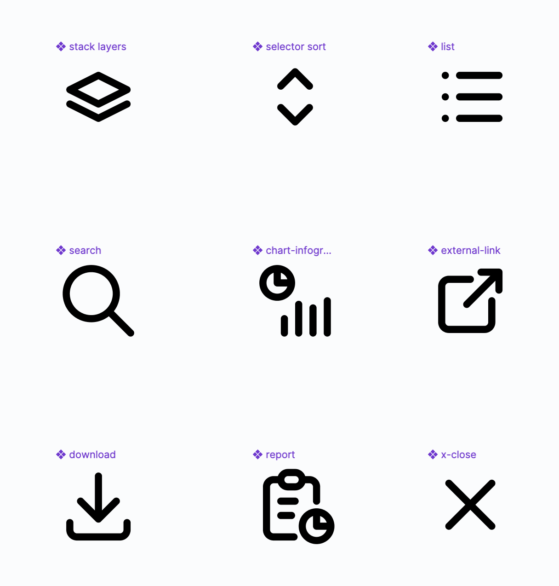
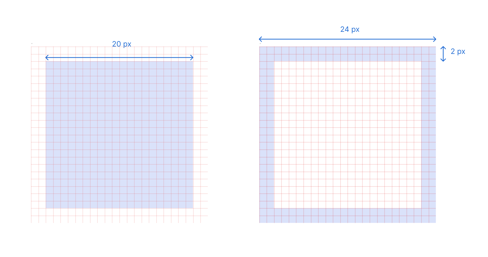
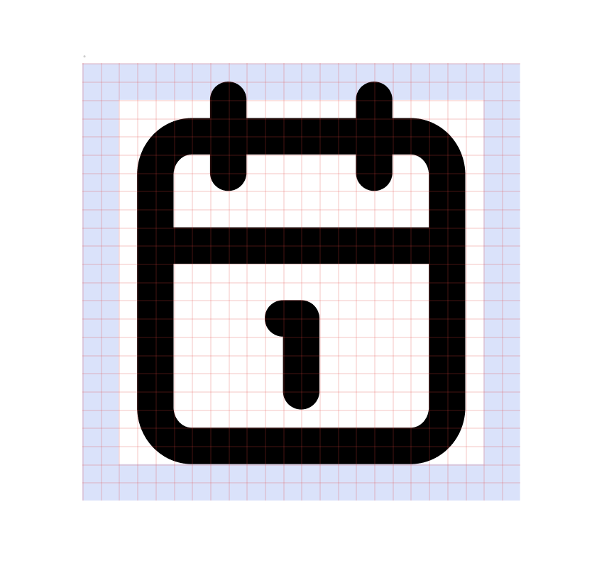

# Icons

oPub supports the full range of Tabler icons in stroke width 2px. These icons can be used as both ‘stroke-only’ or ‘filled’ depending on the use case of the product.

Find the Tabler icons [here](https://tabler.io/icons).

## Icon Usage

Use icons with and without supporting text to convey information and use case for various components.\
Ensure that in cases where supported text is required in information dense layouts, tooltips are provided for the icons.\
While using icons to support text, ensure that the icon isn't aligned with the text baseline. Horizontally centre the icon with the text instead.

Keep minimum icon size at __24px__. Anything lesser than that will hinder accessibility.

## Making Custom Icons

*In case icons need to be created for specific requirements, a few guidelines are to be followed.*

### Icon Sizing

The space of __24px__ is considered the target area for an icon.\
Icon content should remain inside of the target area, ideally within __20px__ of the target area, leaving a __2px__ trim.

If additional visual weight is needed, content may extend into the padding between the target area and the trim area.\
 __No parts of the icon should extend outside of the trim area.__

### Icon Style

A few style rules to follow when making custom icons

- make icons simple and 2-dimensional.
- ensure consistent stroke width of 2px for all icons.
- keep the exterior corner rounding at 2px.

- interior corner rounding can be varied based on icon complexity.

- in case of filled icons, ensure that the negative counter strokes are also 2px.
